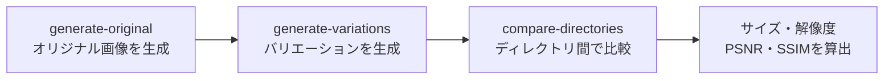

一言にJPEG、PNG、GIFといっても、内部には多くのバリエーションがあります。JPEGならExifの有無や圧縮方式の違い、色成分のサブサンプリングなどです。

アイデアマンズではWeb画像に関するサービスを展開しています。その過程で、内部フォーマットのバリエーションを包括的に網羅したデータセットを、生成プログラムとともにOSSで公開しました。この記事では、なぜ網羅データセットが必要なのか、ツールキットで何ができるのかを整理します。

- [ideamans/web-image-format-variation-toolkit](https://github.com/ideamans/web-image-format-variation-toolkit)

## フォーマットバリエーションという落とし穴

画像処理サービスでは、実運用になって思わぬトラブルが報告されることもあります。よく調べると、あまり一般的でないフォーマットオプションが使われていた、というケースが多いものです。

たとえばExifの向き情報が特殊だったり、めったに見ないサブサンプリング設定だったりします。開発中に用意したサンプル画像では、こうしたレアケースを踏みません。だから問題は運用に入ってから顔を出します。

変換処理の堅牢性を事前に確かめるには、起こりうるバリエーションをあらかじめ網羅したデータセットが要ります。断片的に集めた画像では、どの因子を試せていないかが分かりません。網羅データセットは、その抜け漏れをなくすための土台です。

## ツールキットの3つの機能

このツールキットはJPEG・PNG・GIFを対象に、次の3つの機能を用意しています。生成から比較までを一本の流れで扱えます。



### オリジナル画像の生成

Webから集めた画像には、すでに何らかのクセがあります。たとえばサブサンプリングがすでに4:2:2なら、4:4:4へアップスケールしても違いが分かりにくくなります。

そこでオリジナル画像は、プログラムで生成します。これでフォーマット的にピュアなデータを用意できます。

```bash
python toolkit.py generate-original
```

### バリエーションの変換・生成

オリジナル画像をもとに、内部フォーマットのオプションを調整してバリエーションを生成します。

因子の組み合わせは無数にあります。そこで各パラメータを単独で変えたものと、注意が必要な因子の組み合わせを特別に生成しています。

```bash
python toolkit.py generate-variations
```

生成物は `output` ディレクトリに作られます。実際の画像データもリポジトリに含めているため、画像だけを使うならプログラムの実行は不要です。バリエーションの一覧は `index.json` として出力されます。

### ディレクトリ間の画像比較

同じ名前の画像データセットが入った2つのディレクトリを比較する機能も用意しました。ファイルサイズ、解像度、視覚的な差異（PSNRとSSIM）を計算します。

```bash
python toolkit.py compare-directories output compare
```

これは弊社特有の事情ですが、画像を軽量化した後で、仕様や見た目が大きく変わっていないかを確認するためです。網羅データセットに変換をかけ、変換前後を比較すれば、想定外の劣化や破損を機械的に洗い出せます。

## 網羅データセットが支える互換性の検証

このツールキットの価値は、変換処理の互換性と堅牢性を体系的に検証できる点にあります。

単独のサンプルで通ったからといって、あらゆる入力で通るとは限りません。フォーマットの因子を網羅したデータセットを一括で流せば、どの条件でどう振る舞うかを一覧で把握できます。レアケースの取りこぼしを、運用前の段階で見つけられます。

弊社の画像系サービスでも、今後はこのデータセットを活用していきます。なおこのプロジェクトは、ほとんどClaude Codeで作成しました。バリエーションの案があれば、リポジトリへお寄せいただけると助かります。

## まとめ

- JPEG・PNG・GIFの内部には、Exifの有無や圧縮方式、サブサンプリングなど多くのバリエーションがある
- レアなフォーマットオプションは運用後にトラブルとして現れやすく、網羅データセットで事前に検知できる
- ツールキットはオリジナル生成・バリエーション生成・ディレクトリ比較（PSNR/SSIM）の3機能を持つ
- 画像データはリポジトリに同梱済みで、画像だけの利用なら実行は不要

詳しい使い方やオプションは、リポジトリと元記事にまとめています。

- [ideamans/web-image-format-variation-toolkit](https://github.com/ideamans/web-image-format-variation-toolkit)
- [Web画像フォーマットの細かなバリエーションを網羅するデータセットとツールキットを公開](https://notes.ideamans.com/posts/2025/web-image-format-variation-toolkit.html?utm_source=zenn&utm_medium=blog&utm_campaign=notes-digest)
