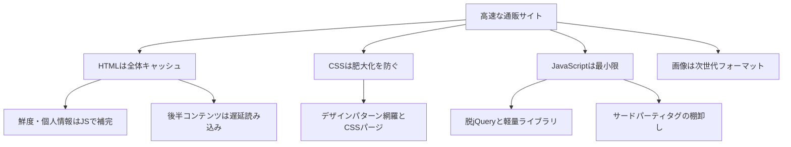

体感スピードの速い通販サイトはどう作ればよいか。アイデアマンズがこれまでの改善案件で積み上げてきた設計と実装のプラクティスを、体系立てて紹介します。

この記事は新規に立ち上げるサイトや、大幅なリニューアルを前提としています。既存サイトの手直しにはあまり向かないので、あらかじめご了承ください。

最新の技術は登場しません。汎用的で実績のあるプラクティスだけに絞っています。

## 通販サイトは複合的なサイト

通販サイトはメディアサイトより設計の難易度が高いサイトです。求められる性質が複合的だからです。

- 読み物としての側面: ユーザーはまず商品探しや情報収集をする
- ダイナミックな側面: 在庫や価格は即座に反映する必要がある
- パーソナルな側面: ログインしたユーザー固有の情報を扱う
- インタラクティブな側面: 検索や商品選択、注文操作が発生する

メディアサイトなら、一度公開した記事が頻繁に変わることはありません。通販サイトは鮮度の高い情報と個人的な情報を同時に扱うため、単純なキャッシュ戦略では済みません。

この複合性を踏まえると、高速化の設計はいくつかの原則に分解できます。全体像を先に示します。

順番に見ていきます。

## HTMLはまるごとキャッシュする

トップページや商品情報ページのHTMLは、CDNにまるごとキャッシュすることを推奨します。

商品情報や写真はそこまで頻繁には変わりません。通販サイトはまず読み物としての側面があります。HTML全体をキャッシュして即座に応答すれば、体感速度を最大限に高められます。

多くの通販サイトはリクエストのたびにHTMLを生成しています。当然ながら応答は遅くなり、サーバーも過負荷になりがちです。

### 鮮度・パーソナルな情報はJavaScriptで補う

HTMLを動的に生成する理由は、在庫や価格などの鮮度の高い情報と、カートの状態などパーソナルな情報があるからです。

しかしこれらは画面全体のごく一部にすぎないことが多いはずです。その部分だけをJavaScriptで取得して反映すればよいわけです。全体はHTMLをキャッシュし、アクセントとなる部分だけをJavaScriptで動かす戦略です。

パーソナルな情報は更新頻度が高くありません。ローカルストレージをキャッシュとして表示を速め、裏で情報を更新する手も使えます。

## 後半のコンテンツは遅延読み込みする

通販サイトは販促のため1ページに多数のコンテンツを盛り込みがちです。レコメンドや巨大なフッターがその例です。ページは縦に長くなり、描画にCPUを消費します。

ところがユーザーがページ下部までスクロールするとは限りません。ヒートマップを見ると、下部まで進む機会はむしろ稀です。

そこでHTMLに最初から載せるのはページ前半の主要な情報だけに留め、CPUをその表示に集中させます。後半の補助的な要素は、スクロールのそぶりを見せてから交差オブザーバー（Intersection Observer）で遅延読み込みします。

細かく制御したくなりますが、目的は表示直後の体験を最善化することです。前後の二分割で十分だと考えています。

## CSSは肥大化を防ぐ

CSSが速やかに読み込まれることも高速なページの条件です。しかし通販サイトは長期運用でCSSが肥大化しやすくなります。

不要なCSSは削って最小限にしたいところですが、それを人力で行うのは事実上不可能です。足りないCSSは見ればわかりますが、不要なCSSは知覚する手段がないからです。

### デザインパターンの網羅とCSSパージ

そこでデザインパターンの網羅とCSSパージを使います。CSSパージはHTMLとCSSを機械的に照合し、不要なCSSを自動で削除するツールです。PurgeCSSが代表例です。

通販サイトは決まった要素の組み合わせで構成されます。それらをデザインパターンとして網羅しておき、定期的にCSSパージを行えば、肥大化を防げます。

特集ページのような、その場限りのCSSはデザインパターンに含めません。別ファイルやインラインスタイルとして切り離します。

### 画像のインライン展開は控える

かつてはリソースをひとつにまとめる方がよいとされ、CSSに画像をBase64で展開する手法が注目されました。しかしHTTP/2の普及で効果は縮小し、今や悪手ですらあります。

表示高速化の大原則は、HTMLとCSSを全速力で処理することです。CSSに画像データを含めて肥大化させると、CSSの処理が遅れます。

## JavaScriptの利用を最小限に

意外に思われるかもしれませんが、Webページが遅い一番の原因はJavaScriptです。とりわけサードパーティのスクリプトの影響が大きいものです。

JavaScriptは目に見えないため重さがわかりません。しかし効果は派手で、現場では雑に乱用されがちです。極端に言えば、JavaScriptを使わなければ重いページを作る方が難しいくらいです。

HTMLをキャッシュしてJavaScriptで動的な情報を補う戦略と矛盾するようですが、そのJavaScriptも最小限に抑えるべきというのが弊社の考えです。

### 脱jQueryと軽量ライブラリ

jQueryは便利でプラグインも豊富ですが、それゆえ乱用の元にもなります。今や標準のJavaScriptでもjQuery相当の機能がそろっています。新規サイトでは初めからjQueryをNGにするのはよい方策です。

jQueryでやりたいのは主にDOM操作です。ただしjQueryはDOM操作を逐一行うため重く、複雑さが増すほど遅くなります。たとえばAlpine.jsはVue.jsのようなリアクティブ機能を軽量に提供します。

そもそもJavaScriptが本当に必要かも厳しく検討します。カルーセルやモーダルはCSSだけで表現できます。同じアニメーションでも、CSSによる実装はJavaScriptよりはるかに軽いものです。

## サードパーティタグの管理

商用サイトの運用にサードパーティタグは欠かせません。しかしスマートフォンでは、本来のコンテンツよりサードパーティタグの方が重い負担を与えているサイトが少なくありません。

### まずリセットして必要なものだけ足す

不要なタグを削除するアプローチは、まず上手くいきません。そのタグが不要だと責任を持つのが難しいからです。

そこで逆にします。いったんサードパーティタグをリセットし、必要だと責任を持てるタグだけを追加します。

### GTMのコンテナはひとつに

Google Tag Managerはコンテナ単位のオーバーヘッドが大きいツールです。権限分離のために1ページへ複数のコンテナを読み込む例をよく見かけますが、パフォーマンスの観点では悪手です。利用するコンテナはひとつにまとめます。

### できるだけ遅延読み込みする

タグを指示どおり素直に埋め込むと、ページ表示のプロセスで大渋滞します。優先度の低いタグは遅延読み込みし、本来のコンテンツ表示に道を開けます。計測系タグを遅らせるとデータが狂うのではと心配されますが、大渋滞の今もすでに計測は偶然に左右されています。

## 画像は次世代フォーマットで

通信環境の進化により、画像は大きいけれど重くはない存在になりました。とはいえ通販サイトは画像が主役で、大量に読み込まれます。軽量化はやはり有効です。

これからの画像軽量化は次世代画像フォーマットに頼るのが正解です。JPEGやPNGの軽量化は工夫が要りますが、WebPに変換するだけでデータは半分以下になります。

コスト面の効果も見逃せません。AWSなどの海外クラウドはデータ転送量がそのままコストに反映されます。通販サイトの転送量の大半は画像です。軽量化はそのまま転送コストの削減につながります。

## Webフォントは必要か

Webフォントは表示速度に影響が出にくいよう工夫されていますが、日本語フォントはそれでも重いものです。パフォーマンスの観点では使わない方が無難です。

欧文フォントは軽量なので、ブランド感の演出に使うのは合理的です。一方でユーザーは買い物に来ているのであり、通販サイトに日本語Webフォントが別途必要になる場面は滅多にないと考えています。

## まとめ

新規構築や大幅リニューアルを前提に、高速な通販サイトの設計と実装を体系立てて紹介しました。

新しい技術の話はありません。スマホやPCのリソースは有限で、ブラウザの動作には特性があります。それを意識して作れば、サイトは自ずと速くなります。

サイト高速化はダイエットとよく似ています。新しい手法やサプリを追いかけても目的は達せられません。基本を愚直に続け、重くなってから対処するのではなく、重くならないよう予防するのが最上の戦略です。

- [高速な通販サイトのための設計と実装](https://notes.ideamans.com/posts/2025/ec-speed-practice.html?utm_source=zenn&utm_medium=blog&utm_campaign=notes-digest)
