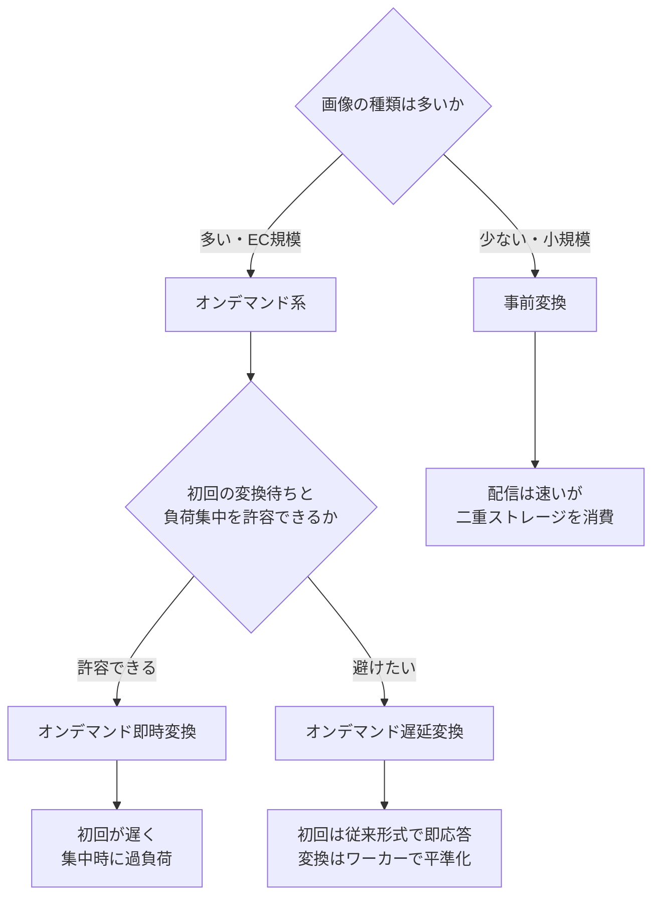

Web画像をWebPやAVIFなどの次世代フォーマットにすると、同じ画質でもデータ量を大幅に削減できます。海外クラウドのデータ送信料金が下がり、ユーザーの通信負担も軽くなります。

一方で、従来フォーマット（JPEG・PNG・GIF）は活躍期間が長すぎました。供給側のスキルやシステム仕様はすぐに追いつかず、次世代フォーマットへの信頼感の醸成にも時間を要します。

そのため当面は、元画像を従来フォーマットで供給しつつ、次世代フォーマットへの変換は配信目的に留める体制が続くとアイデアマンズは見ています。この記事では次世代の代表を仮にWebPとし、いつ変換するのが良いかを設計の観点で論じます。

## 事前変換かオンデマンド変換か

変換のタイミングは、大きく2つのアプローチに分かれます。

1. **事前変換（Eager transformation）**
   バッチ処理などでまとめてWebPに変換しておき、配信時には変換済みのWebPを返す方式である。

2. **オンデマンド変換（Lazy transformation）**
   ユーザーからのリクエストがあった段階で変換を開始し、変換したWebPを返す方式である。

それぞれのメリットとデメリットを整理します。

| | 事前変換 | オンデマンド変換 |
| :--- | :--- | :--- |
| **メリット** | 配信時点でWebPが用意済みのため、レスポンスが安定して速い | 必要なタイミングだけ変換し、不要な変換を避けられる |
| **デメリット** | アクセスされない画像まで変換され、従来とWebPの二重でストレージを消費する | 初回アクセスは変換待ちが生じ、アクセス集中時は変換処理がサーバーを強く圧迫する |

事前変換は、画像の種類が少ない小規模サイトなら変換ロスは少なく、ストレージ消費も小さく済みます。しかしECサイトのように画像の種類が多いと、これらが制約になります。おのずとオンデマンド変換の一択になるでしょう。

一方でオンデマンド変換は小規模サイトに適用しても問題ありません。潰しの効く方式と言えます。

## オンデマンド変換の功罪

オンデマンド変換は一見メリットが多いように思えます。しかし愚直に実装すると次の問題が生じます。

- **初回ユーザー体験の悪化**
  変換済みのWebPをキャッシュするとしても、初回アクセスは変換を待つ間だけ画像の表示が遅れる。
- **性能弾力性の低下**
  WebP変換はそれなりに負荷の高い処理である。アクセスが集中するとサーバーリソースをすぐに圧迫する。

小規模サイトならキャッシュはすぐ有効に機能します。一方でECサイトは、ロングテール上にアクセス頻度の低いページを多数抱えがちです。

全体として画像への初回アクセスが多いため、キャッシュが効くからと割り切ることはできません。それより深刻なのがサーバーリソースの圧迫で、アクセス集中時にはダウン状態に陥る恐れがあります。

## オンデマンド遅延変換という工夫

そこでオンデマンド変換のメリットを活かしつつ、デメリットを抑える工夫が **オンデマンド遅延変換** です。おおまかに次の流れで変換します。

1. **初回アクセス**
   即時変換は行わず、ひとまず従来フォーマットの画像を返す。同時に変換ジョブをキューへ登録し、バックグラウンドでWebPへ変換する。

2. **変換処理**
   変換ジョブは所定の並列度でワーカーが逐次処理する。

3. **次回以降のアクセス**
   変換済みでキャッシュされたWebPがあれば、そのデータを返す。

初回アクセスはいち早く従来フォーマットで応答するため、軽量化の恩恵は受けられないものの表示が著しく遅れることはありません。変換も所定数のワーカーが逐次処理するので、アクセスに応じて極度に集中することがありません。

3つの方式を選択肢として並べると、次のように整理できます。

事前変換は配信こそ速いものの、二重のストレージを抱えます。オンデマンド即時変換は初回が遅く集中に弱いです。オンデマンド遅延変換は、初回応答と負荷平準化の両方を両立させる位置づけになります。

## 実装での採用例

アイデアマンズが提供するCloudFront向けの次世代画像フォーマット対応サービス LightFile Proxy は、このオンデマンド遅延変換を採用しています。

おかげで非常に安定して稼働しており、本番運用の開始以降、設計仕様に起因する障害は起きていません。変換タイミングの設計は、性能と安定性の両面に直結する判断だと考えています。

- [WebP変換の適切なタイミングについて](https://notes.ideamans.com/posts/2025/lazy-conversion.html?utm_source=zenn&utm_medium=blog&utm_campaign=notes-digest)
