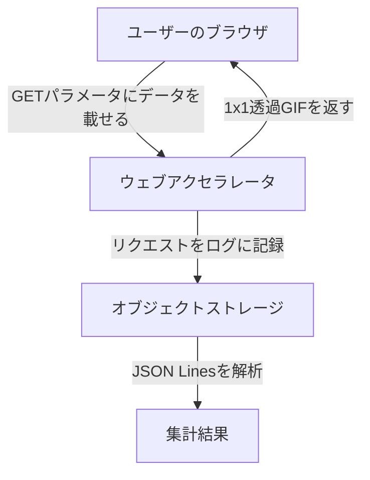

CDNは本来、大量のアクセスを高速かつ安定的にさばくためのインフラです。ところが、さくらインターネットの「ウェブアクセラレータ」には、料金体系の特性を逆手に取った使い方があります。

それは、AWSでいうAmazon Data Firehoseのようなストリーミングデータの収集基盤を、ほぼ無料で作るという設計です。アイデアマンズでは自社サービスでこの構成を実際に運用しています。

この記事では料金体系の仕組みから設計の発想、そして向き不向きまでを順を追って解説します。ログ収集のコストに悩んでいる方の選択肢になれば幸いです。

## 前提: ウェブアクセラレータのログ機能

きっかけは機能追加でした。さくらインターネットは2024年11月に、ウェブアクセラレータへアクセスログ機能を追加しました。

この機能では、ユーザーからのリクエスト内容やレスポンスステータスを記録したアクセスログが、さくらのクラウドオブジェクトストレージへ定期的にアップロードされます。フォーマットはgzip圧縮されたJSON Lines形式です。

以前はトラフィックを分散・配信する機能のみで、生ログを取得する手段がありませんでした。ログ機能の追加により、CDNを収集基盤として使う道が開けたわけです。

## 鍵になる料金体系

ウェブアクセラレータの料金は非常にシンプルです。ここが設計の出発点になります。

- 課金対象はアウトバウンド転送量のみ（5円/GiB・税込）
- インバウンド転送量は無料
- リクエスト数による課金もなし
- 初期費用・固定費もなし

注目すべきは「アウトバウンドのみ課金」という一点です。ユーザーから送られてくるインバウンドのデータには課金されません。この非対称性が、以降の発想すべての土台になります。

## 設計: GETパラメータをログに書き込む

発想はシンプルです。送りたいデータをGETパラメータに載せてCDNへリクエストし、それをアクセスログに残すのです。



流れは次のようになります。

1. JavaScriptでユーザーの行動データを集める
2. データをGETパラメータに載せてCDNへリクエストする
3. CDNは1x1ピクセルの透過GIFなど最小限のレスポンスを返す
4. リクエストURLがアクセスログに記録される
5. 後でログを解析してデータを集計する

```javascript
// 例: ユーザーの行動データを送信する
const data = {
  event: 'click',
  target: 'buy_button',
  timestamp: Date.now(),
  viewport: `${window.innerWidth}x${window.innerHeight}`
}
const params = new URLSearchParams(data)
new Image().src = `https://your-cdn.sakura.ad.jp/track.gif?${params}`
```

なぜコストが抑えられるのか。GETパラメータにどれだけデータを詰め込んでも、それはインバウンドで無料だからです。一方でレスポンスは数十バイトの1x1画像に抑えられ、アウトバウンドはほぼゼロになります。

## 同一オリジンポリシーとの相性

この構成には、もうひとつ好都合な事情があります。ブラウザのセキュリティ制約である同一オリジンポリシーとの相性です。

JavaScriptは基本的に、配信元と同じオリジンにしかデータを送れません。そこで、JavaScriptライブラリ自体をCDNで配信し、同じドメインでデータも受け取る構成にします。

すると収集の全体がCDN上で完結します。ライブラリのサイズが小さければアウトバウンド課金はわずかで済み、データ送信は無料、別途APIサーバーを立てる必要もありません。制約だったはずのオリジン問題が、むしろ設計の追い風になります。

## 実運用のコスト感

アイデアマンズではこの構成を、Ranklet4というアクセスランキングのサービスで使っています。ランキングの表示回数やクリックされた順位を収集する用途です。

扱うトラフィックは月間数億PV規模ですが、このログ収集にかかるコストは月額数百円から数千円程度で収まっています。同じトラフィックをData Firehoseで処理した場合と比べると、桁が変わります。

## Data Firehoseとの比較

正攻法のFirehoseと、この構成の性質を並べると違いがはっきりします。

| 項目 | Data Firehose | ウェブアクセラレータ |
|---|---|---|
| 課金単位 | リクエスト数 + データ量 | アウトバウンド転送量のみ |
| 受信データの課金 | あり | なし |
| リアルタイム性 | 数分以内 | 最大1時間のラグ |
| データ形式 | 自由 | URLパラメータ（約2KB制限） |
| 処理の柔軟性 | Lambda連携など豊富 | ログファイル解析のみ |

Firehoseは柔軟で高機能ですが、トラフィックに比例してコストが増えます。ウェブアクセラレータは制約こそあるものの、大量のリクエストを低コストでさばけます。

### CloudFrontでは成立しにくい

同じCDNでも、AWS CloudFrontで同じ手を真似るのは要注意です。CloudFrontはデータ転送量に加えて、リクエスト数に応じた課金が発生するからです。

HTTPSリクエストの場合、1万リクエストあたり0.01ドル程度（リージョンにより異なる）です。一見わずかですが、収集の規模では数百万から数億リクエストになることも珍しくありません。1億リクエストなら100ドル程度のリクエスト課金が上乗せされます。

ウェブアクセラレータはリクエスト数による課金がありません。レスポンスを最小限に抑えれば、リクエストがいくら増えてもコストにほとんど響きません。この料金体系の違いが、今回の設計を成立させています。

## 制約と注意点

万能ではありません。採用の前に把握しておくべき制約が3つあります。

まず、ログは1時間ごとに生成・アップロードされます。リアルタイム処理には向かず、日次や週次の集計向けです。

次に、GETパラメータには実質約2KBの制限があります。大きなデータは分割するか、圧縮する工夫が要ります。

最後に、ログの解析ロジックは自前で実装します。JSON Linesをパースし、URLパラメータをデコードして集計します。

```python
# ログ解析の例（Python）
import gzip
import json
from urllib.parse import parse_qs, urlparse

with gzip.open('access_log.json.gz', 'rt') as f:
    for line in f:
        record = json.loads(line)
        url = record.get('request_uri', '')
        params = parse_qs(urlparse(url).query)
        # データを集計...
```

なお、さくらインターネットがこの使い方を想定しているかは定かではありません。公式に禁止されてはいませんが、将来料金体系が変わる可能性はあります。本番導入の際はその点も見込んでおいてください。

## まとめ

CDNの料金体系は通常、大容量コンテンツの配信を前提に設計されています。その前提を逆に使うと、アウトバウンドのみ課金という特性が収集基盤の武器に変わります。

- インバウンド無料・リクエスト無料の料金体系が設計の土台になる
- GETパラメータにデータを載せ、1x1画像で返してログに記録する
- 同一オリジンポリシーの制約が、CDN完結の構成では追い風になる
- リアルタイム性と約2KB制限を許せる用途なら、コストは桁違いに下がる

大量のデータを集めたいがFirehoseのコストが気になる、という場面で思い出す価値のある選択肢です。

- [さくらのCDN料金体系の裏をかいた激安AWS Firehoseとして使う「ずるい使い方」](https://notes.ideamans.com/posts/2025/sakura-cdn-streaming-hack.html?utm_source=zenn&utm_medium=blog&utm_campaign=notes-digest)
