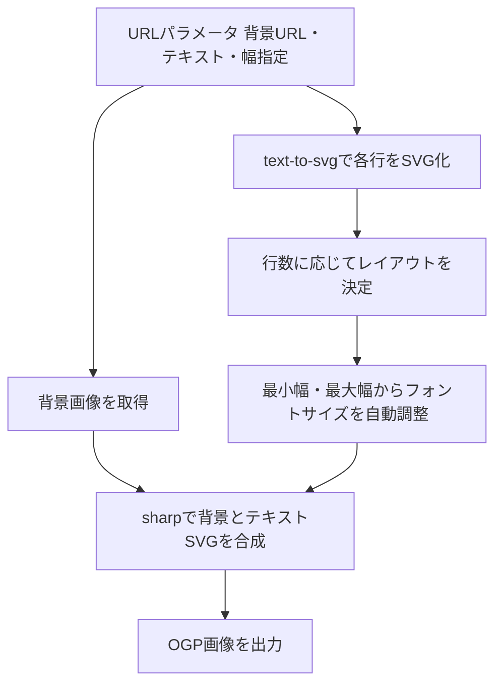

弊社（アイデアマンズ）のブログ「ideaman's Notes」では、はてなブログやQiitaのように、記事タイトルからOGP画像（SNSシェア用のアイキャッチ画像）を自動生成しています。

そのためのバナー生成システムを自作し、`banner-generator` という名前でOSS公開しました。

https://github.com/ideamans/banner-generator

既視感のあるテーマですが、以前から自分の手で作ってみたいと考えていたものです。この記事では、テンプレート設計と生成の仕組みを、設計判断もあわせて紹介します。

## ヘッドレスブラウザを使わないという選択

テンプレートライクな画像生成には、いくつかのアプローチがあります。

もっともメジャーなのは、ヘッドレスブラウザでHTMLとCSSをレンダリングし、スクリーンショットを撮る方法でしょう。慣れたHTMLとCSSで組めるうえ、ブラウザの高い表現力をそのまま使えます。`node-html-to-image` のようなライブラリを使えば、実装自体は容易です。

弊社がOSSで提供するWebページ録画ツール loadshow でも、この技術を使っています。

当初はこの方向で考えました。ただ、ブラウザを動かす方式はとにかく重く、動作環境の用意や日本語フォントのインストールなどハードルも高くなります。今回は低性能のサーバーで動かしたい事情もあり、別のアプローチを選びました。

## 仕様を絞り込む

他サイトの自動生成OGP画像を観察して、次の3つを満たせば自分には十分だと判断しました。

1. 背景画像を自由に選べる
2. 3行のテキストを中央揃えで縦方向に均等配置できる
3. テキストのサイズや配置を少しカスタマイズできる

これだけならヘッドレスブラウザを持ち出すまでもありません。要件を削ったことで、軽量な実装への道が見えました。

## sharpとtext-to-svgで組み立てる

採用したのは、Node.jsのグラフィックライブラリ sharp と、フォントからテキストのSVGを生成する text-to-svg の組み合わせです。

sharpは画像の合成を手軽に扱えます。text-to-svgはフォントファイルから文字の輪郭をSVGデータとして書き出せるので、これを背景画像へ重ねる流れになります。

生成の流れは次のとおりです。

画像URLのパラメータに背景画像のURL・ブログ名・記事タイトル・日付を渡すと、プログラムがそれらを合成して1枚のOGP画像を返します。テキストの輪郭もきれいに合成でき、動作も軽快です。

## テンプレート設計で工夫した点

### 行数によってレイアウトを変える

主な用途は3行テキストのOGP画像ですが、1行と2行のレイアウトも個別に実装しました。プレゼンテーションスライドで好んで使う配置を、そのまま持ち込んだものです。

1行なら上下左右の中央に配置します。2行ならメインタイトルとサブタイトルのような見た目になります。3行なら縦方向に均等配置します。

行数ごとに配置ルールを分けたことで、少ないパラメータでも見栄えが安定します。

### フォントサイズの自動調整

記事タイトルを流し込むので、文字数は一定ではありません。フォントサイズが固定だと、短いテキストは小さくなりすぎ、長いテキストは枠からはみ出してしまいます。

そこでテキスト幅の最小値と最大値を指定できるようにしました。その範囲を外れたときだけ、フォントサイズを自動で調整します。

たとえば最小幅50%・最大幅90%と指定すると、短いテキストは大きく、長いテキストは小さく描かれ、どちらも枠に収まります。流し込む文字数が読めない用途では、この仕組みが効きます。

## 残した課題

今回の要件は満たしましたが、改良したい点はまだあります。

- 明示的な改行への対応
- ハッシュトークンによる生成リクエストの保護
- 上下余白の個別指定
- 背景画像の色味調整

MITライセンスで公開しているので、気軽に利用したりフォークして改良したりしていただければうれしいです。

## まとめ

- OGP画像の自動生成は、必ずしもヘッドレスブラウザを必要としない。
- 要件を「背景＋3行テキスト」に絞れば、sharpとtext-to-svgだけで軽量に実装できる。
- 行数別のレイアウトとフォントサイズの自動調整があれば、流し込む文字数が読めなくても破綻しない。

設計の背景や実際の生成例は、リサーチノートにまとめています。

- [OGP画像を自動生成するプログラムをOSSで公開](https://notes.ideamans.com/posts/2024/banner-generator.html?utm_source=zenn&utm_medium=blog&utm_campaign=notes-digest)
