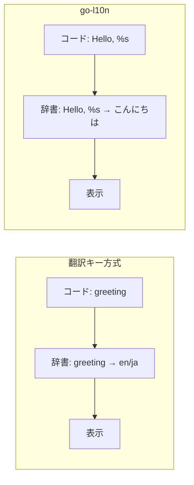

Go言語で自然言語メッセージを翻訳する、ローカライゼーション用のパッケージ go-l10n をOSSとして公開しました。アイデアマンズで社内ツールを多言語化する中で生まれたものです。

このライブラリは[Movable Type](https://www.sixapart.jp/movabletype/)のローカライゼーションから着想を得た仕様になっています。何が普通のi18nと違うのか、なぜその設計にしたのかを、コードを追いながら紹介します。

## よくある辞書は「翻訳キー」を別に用意する

メッセージ翻訳の辞書といえば、PO/POT形式やYAMLに書く方法をよく見かけます。Goにも標準的な `golang.org/x/text/message` があります。

これらの方法は、多くの場合メッセージキーを別途用意します。YAMLで例えると、次のような形です。

```yaml
greeting:
  en: "Hello, %s"
  ja: "こんにちは、%sさん"
```

プログラム側では `greeting` というキーを使って、言語に応じたメッセージを引きます。合理的な設計ではあります。

ただ、自分には認知的な負荷が高く感じられました。`%s` のようなプレースホルダを持っていても、実際のメッセージを見るまで、そこに何が入るのか分かりません。

メッセージ文面は、そのときの判断で分かりやすく変えたくなることも多いものです。すると `greeting` という抽象キーはそのままなのに、辞書ファイルから該当箇所を探して直すという手間が毎回発生します。

## Movable Type流は「英語メッセージ自体」をキーにする

Movable Typeのローカライゼーションは、この点が違いました。英語のメッセージそのものをキーとして、プログラム上の文字列マップで辞書を表現します。

```go
jpDictionary := map[string]string{
  "Hello, %s": "こんにちは、%sさん",
}
```

`greeting` のような中間キーがありません。コードに書かれた英語がそのまま辞書の左辺になります。この違いを図にすると、参照の流れがシンプルになっていることが分かります。



この方式にはシンプルすぎるゆえの弱点もあります。キーが長い文字列なので照会は相対的に遅く、単数形と複数形のような動的なローカライゼーションには対応できません。

それでも得られる心地よさがあります。まず英語メッセージだけでプログラムを書き進め、UIのフィーリングを確認できます。中間キーと実メッセージの対応を頭の中に保持しておく必要がなく、記憶領域を奪われないのです。

そこでGo向けに自分でも用意した、というのが go-l10n の経緯です。

## 使い方

翻訳したいメッセージは `l10n.T` に英語のまま渡します。コードを読むだけで表示文言が分かるので、可読性が高くなります。

翻訳辞書は `init` の中で `l10n.Register` に渡します。これでグローバルな日本語辞書に翻訳がマージされます。

```go
package main

import (
	"fmt"

	"github.com/ideamans/go-l10n"
)

func main() {
	fmt.Println(l10n.T("Hello, World!"))
}

func init() {
	l10n.Register("ja", l10n.LexiconMap{
		"Hello, World!": "こんにちは、世界！",
	})
}
```

辞書に登録が無いメッセージは、キーである英語がそのまま出力されます。つまり翻訳を書く前でも英語で動くので、実装を止めずに進められます。

このほかにも実用上の機能がそろっています。環境変数からの言語自動判別、テスト時に英語へ固定する機能、`fmt.Sprintf` や `fmt.Errorf` に相当するシュガーシンタックスなどです。詳しくはREADMEを参照してください。

## まとめ

go-l10n は、翻訳キーを別に設けず、英語メッセージ自体をキーにするGo向けのi18nライブラリです。

- 中間キーを介さないので、コードを読むだけで表示文言が分かる
- 文面の変更が、辞書の対応を探し直す作業を伴わない
- 未登録のメッセージは英語のまま出るので、翻訳前でも実装を進められる

照会速度や複数形対応といったトレードオフはありますが、認知負荷の低さを重視するなら選択肢になります。設計の背景と経緯は、次の記事にまとめています。

- [Go言語のローカライゼーションパッケージ go-l10n を公開](https://notes.ideamans.com/posts/2025/go-l10n.html?utm_source=zenn&utm_medium=blog&utm_campaign=notes-digest)
